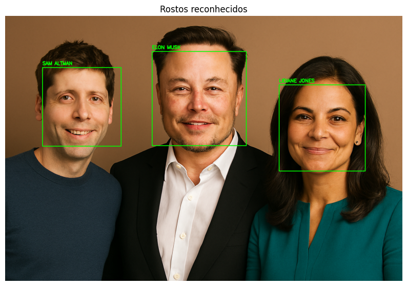

# 🧠 Desafio de Projeto: Reconhecimento Facial com Transfer Learning

Este projeto faz parte do **Bootcamp Machine Learning da BairesDev** promovido pela **DIO.me**, e tem como objetivo aplicar técnicas de **Transfer Learning** para realizar o **reconhecimento facial de múltiplos rostos em uma única imagem**, utilizando modelos de deep learning pré-treinados.

---

## 🎯 Objetivo

Reconhecer os rostos de **Elon Musk**, **Sam Altman** e **Lidiane Jones** em uma imagem de teste, utilizando um banco de dados personalizado com imagens de referência para cada pessoa.

---

## 🗂️ Estrutura do Projeto

```bash
desafio-reconhecimento-facial/
├── faces_db/
│   ├── elon_musk/
│   ├── lidiane_jones/
│   └── sam_altman/
├── test_1/
│   └── test_1.png
├── results/
│   └── resultado_test_1.png
└── desafio_reconhecimento_facial.ipynb
```

---

## 🧪 Tecnologias Utilizadas

- **DeepFace**: biblioteca de reconhecimento facial que encapsula modelos pré-treinados como VGG-Face, Facenet, ArcFace, entre outros
- **VGG-Face**: modelo de deep learning utilizado para extração de embeddings faciais
- **OpenCV**: para leitura de imagens, desenho de bounding boxes e exibição dos resultados
- **Matplotlib**: para visualização das imagens processadas
- **Google Drive**: utilizado como repositório de dados no ambiente Colab

---

## ⚙️ Funcionalidades Implementadas

- Detecção de múltiplos rostos em uma imagem
- Extração de embeddings faciais com o modelo VGG-Face
- Comparação com banco de dados personalizado usando métrica de distância cosseno
- Identificação dos rostos com nomes completos em caixa alta
- Exibição da imagem final com bounding boxes e nomes reconhecidos

---

## 📌 Transfer Learning na Prática

Este projeto utiliza **Transfer Learning** ao reaproveitar o modelo pré-treinado `VGG-Face`, que já foi treinado com milhões de imagens de rostos. Em vez de treinar um modelo do zero, aplicamos esse conhecimento para reconhecer rostos específicos com um banco de dados pequeno e personalizado.

---

## 📷 Exemplo de Resultado

A imagem de teste é processada e os rostos são identificados com caixas verdes e os seguintes nomes:

- **SAM ALTMAN**  
- **ELON MUSK**  
- **LIDIANE JONES**
  


---

## ▶️ Como Usar o Projeto

### Passo 1: Clone o Repositório

Para obter o código do projeto, use o comando `git clone` no seu terminal:

```bash
git clone [https://github.com/Cantalixto/desafios-bairesdev.git](https://github.com/Cantalixto/desafios-bairesdev.git)
```

Em seguida, navegue até a pasta específica do projeto:

```bash
  cd desafios-bairesdev/desafio-reconhecimento-facial
```

### Passo 2: Execute o Notebook no Google Colab

1. Abra o arquivo `desafio_reconhecimento_facial.ipynb` no Google Colab.

2. Certifique-se de que o tipo de ambiente de execução está configurado para usar uma GPU.

3. Execute todas as células do notebook para visualizar os resultados.

4. Certifique-se de montar seu Google Drive e ajustar os caminhos para as pastas de dados (`faces_db/` e `test_1/`) no código, conforme necessário.

---

## 🧠 Aprendizados

- Aplicação prática de Transfer Learning com modelos de reconhecimento facial
- Manipulação de imagens e embeddings faciais
- Integração de múltiplas bibliotecas para visão computacional
- Organização de dados e visualização de resultados em notebooks interativos

---

## ❤️ Como Contribuir ou Apoiar

Se este repositório foi útil para você, considere dar uma estrela ⭐️ no canto superior direito para me apoiar. Isso me motiva a continuar criando conteúdo e projetos de qualidade.

Se você deseja usar este projeto como base para o seu próprio trabalho ou propor melhorias, sinta-se à vontade para dar um fork no repositório.

1. Faça o Fork: Clique no botão "Fork" no canto superior direito desta página.
2. Clone o Repositório: Clone o seu fork para sua máquina local.
3. Faça suas Alterações: Crie uma nova branch, faça suas alterações e suba o código.
4. Abra um Pull Request: Envie um Pull Request para que suas alterações possam ser revisadas e, se aprovadas, mescladas ao projeto original.

---
