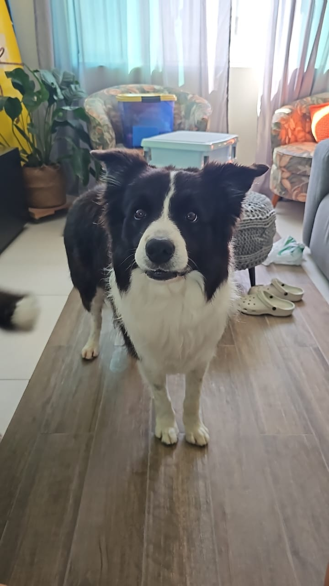

# 🧠 Desafio Transfer Learning – Classificação de Imagens

Este projeto foi desenvolvido como parte do bootcamp da **BairesDev** na plataforma [DIO.me](https://www.dio.me/), voltado para o estudo prático de **Machine Learning**, **Inteligência Artificial** e **Modelos de Linguagem (LLMs)**.

O desafio consiste em aplicar a técnica de **Transfer Learning** para construir um classificador de imagens capaz de distinguir entre **gatos** e **cachorros**, utilizando redes neurais pré-treinadas e ajustando-as para o conjunto de dados proposto.

---

## 🎯 Objetivo

- Utilizar um modelo de rede neural pré-treinado (como VGG16, ResNet ou MobileNet)  
- Realizar fine-tuning para adaptar o modelo ao novo conjunto de imagens  
- Treinar e avaliar o desempenho do classificador  
- Testar o modelo com imagens reais e visualizar os resultados  

---

## 🧰 Tecnologias Utilizadas

- Python 3  
- Google Colab  
- TensorFlow / Keras  
- Matplotlib (visualização)  
- PIL (manipulação de imagem)  

---

## 📂 Estrutura do Projeto
desafio-transfer-learning/ ├── desafio_transfer_learning.py   # Código principal do classificador ├── modelo_transfer.h5             # Modelo treinado salvo ├── loki.jpeg                      # Imagem de teste ├── README.md                      # Documentação do desafi

---

## 🐶 Resultado do Modelo

A imagem abaixo foi utilizada como teste para o modelo treinado. O classificador aplicou Transfer Learning e retornou a seguinte previsão:

  

<strong>Classificação prevista pelo modelo:</strong> Cachorro 🐾

---
