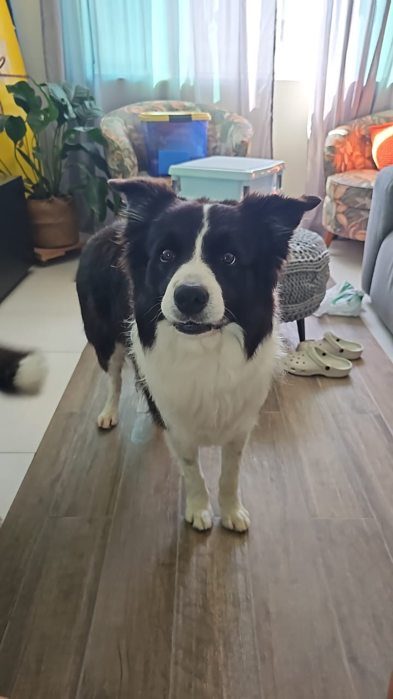

# 🧠 Desafio de projeto: Treinamento de redes neurais com transfer learning 

Este projeto foi desenvolvido como parte do bootcamp da **BairesDev** na plataforma [DIO.me](https://www.dio.me/), voltado para o estudo prático de **Machine Learning**, **Inteligência Artificial** e **Modelos de Linguagem (LLMs)**.

O desafio consiste em aplicar a técnica de **Transfer Learning** para construir um classificador de imagens capaz de distinguir entre **gatos** e **cachorros**, utilizando redes neurais pré-treinadas e ajustando-as para o conjunto de dados proposto.

---


## 🎯 Objetivo

- Utilizar um modelo de rede neural pré-treinado (como VGG16, ResNet ou MobileNet)  
- Realizar fine-tuning para adaptar o modelo ao novo conjunto de imagens  
- Treinar e avaliar o desempenho do classificador  
- Testar o modelo com imagens reais e visualizar os resultados  

---

## 🧰 Tecnologias Utilizadas

- Python 3  
- Google Colab  
- TensorFlow / Keras  
- Matplotlib (visualização)  
- PIL (manipulação de imagem)  

---

## 📂 Estrutura do Projeto
```
desafio-transfer-learning/
├── desafio_transfer_learning.py
├── modelo_transfer.h5
├── loki.jpeg
└── README.md
```

---

## 🚀 Como Usar o Projeto

### Passo 1: Clone o Repositório

Para obter o código do projeto, use o comando `git clone` no seu terminal:

```bash
git clone [https://github.com/Cantalixto/desafios-bairesdev.git](https://github.com/Cantalixto/desafios-bairesdev.git)
```

Em seguida, navegue até a pasta específica do projeto:

```bash
cd desafios-bairesdev/desafio-transfer-learning
```

### Passo 2: Instale as Dependências

Este projeto requer bibliotecas específicas. Você pode instalá-las usando o `pip` :

```bash
pip install tensorflow matplotlib pillow
```

### Passo 3: Execute o Código

Para rodar o classificador e ver o resultado, execute o script principal:
```bash
python desafio_transfer_learning.py
```

---

## 🐶 Resultado do Modelo

A imagem abaixo foi utilizada como teste para o modelo treinado. O classificador aplicou Transfer Learning e retornou a seguinte previsão:

<p align="center">
  
</p>
<p align="center"><strong>Classificação prevista pelo modelo:</strong> Cachorro 🐾</p>

---

## ❤️ Como Contribuir ou Apoiar

Se este repositório foi útil para você, considere dar uma estrela ⭐️ no canto superior direito para me apoiar. Isso me motiva a continuar criando conteúdo e projetos de qualidade.

Se você deseja usar este projeto como base para o seu próprio trabalho ou propor melhorias, sinta-se à vontade para dar um fork no repositório.
1. Faça o Fork: Clique no botão "Fork" no canto superior direito desta página.
2. Clone o Repositório: Clone o seu fork para sua máquina local.
3. Faça suas Alterações: Crie uma nova branch, faça suas alterações e suba o código.
4. Abra um Pull Request: Envie um Pull Request para que suas alterações possam ser revisadas e, se aprovadas, mescladas ao projeto original.

---
